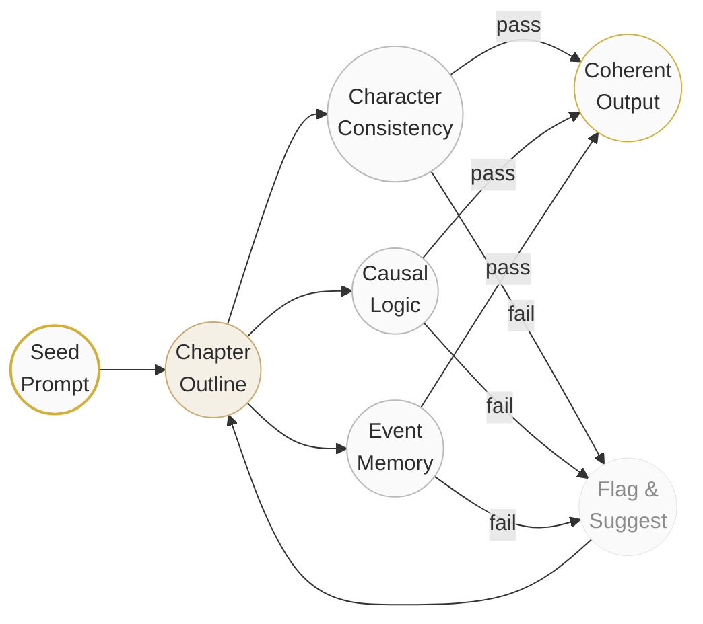

<p align="center">
  <em>No plot holes. No character drift. Every thread is tied.</em>
</p>

<p align="center">
  
  
  
</p>

---

&nbsp;

## ✦ Story Engine

A logic-consistent story-generation engine that helps long-form writers maintain narrative integrity — from the first chapter to the last.

&nbsp;

## ✦ Consistency Pipeline



&nbsp;

## ✦ Three Core Guarantees

| Guarantee | Mechanism |
|-----------|-----------|
| **Character Consistency** | Personality vectors remain stable across chapters |
| **Causal Logic** | Every plot point has a "because → therefore" chain |
| **Event Memory** | All foreshadowing is tracked and echoed in later chapters |

&nbsp;

## ✦ Quick Start

```bash
python story_engine.py --seed "A young woman discovers her best friend has been lying to her for years."
```

The engine generates chapter-by-chapter outlines, checks causal logic, and outputs a self-consistent story. **No technical background needed** — the engine handles logic checks automatically.

&nbsp;

## ✦ Example

**Input:**
> *Elena, a detective, finds a torn photo in her missing partner's drawer.*

**Output (excerpt):**
> *Elena stares at the photo. It was taken two days before he vanished. Her hand shakes — not from fear, but from the realization that the person in the background is her own boss.*

The engine ensures all subsequent chapters remember: the photo, the boss's role, Elena's emotional state, and every planted clue.

&nbsp;

## ✦ For Whom

> Novelists · Screenwriters · Game Narrative Designers · Anyone writing long-form stories

&nbsp;

---

<p align="center">
  <a href="mailto:ai@nohnlins.com">ai@nohnlins.com</a>
</p>
<p align="center">
  <sub>© 2026 Shanghai Linming Junhua &amp; NOHN AI Technology · All Rights Reserved</sub>
</p>
