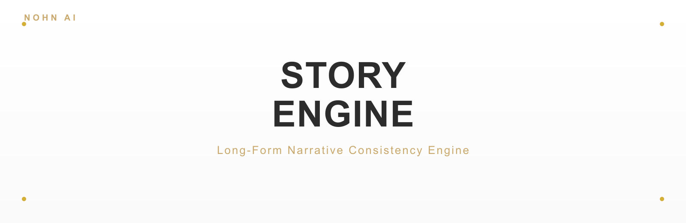
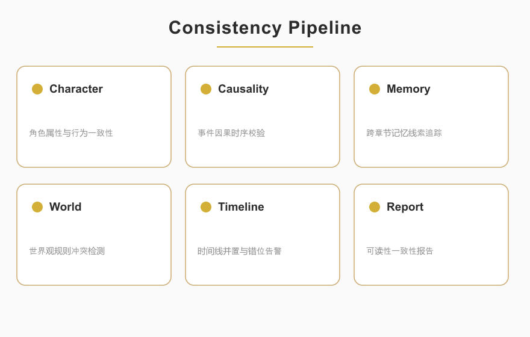

<p align="center">
  
</p>

<p align="center">
  
  
  
  
</p>

<blockquote align="center">
  <em>长篇叙事一致性引擎</em>
</blockquote>

<div style="max-width:880px;margin:0 auto;padding:0 16px">

## ✦ 关于

<p style="font-size:15px;line-height:1.8;color:#2C2C2C">STORY-ENGINE 是面向长篇小说的叙事一致性校验引擎，对人设、因果时间线与记忆线索进行自动化审计，确保百万字作品在人物、剧情、世界观层面保持自洽。它把编辑的直觉性检查转化为可复用、结构化的流水线。</p>

<p align="center">
  
</p>

</div>

<p align="center">— ✦ —</p>

## ✦ 快速开始

```bash
# 主源：GitHub
git clone https://github.com/nohn3043-arch/story-engine.git
# 镜像：Gitee（本仓库）
# git clone https://gitee.com/sjiun/Story-engine.git
cd Story-engine
# 纯 Python ≥3.8。引擎文件按设计使用空格命名。
python "Story Engine for Creator.py"      # 面向创作者的第二视角认知审计引擎
# 或：python "engine for business.py"     # SPL 四阶段编辑流水线
```

<p align="center">— ✦ —</p>

## ✦ 功能

<div style="max-width:880px;margin:0 auto;padding:0 16px">

STORY-ENGINE 对长篇叙事进行一致性审计，将编辑直觉转化为可复用、结构化的流水线。双层架构：

- **创作者引擎**（`Story Engine for Creator.py`）——面向叙事的认知审计层：
  - `ResponsibilityAccount`——每项检查锚定到具名责任节点（谁 / 角色 / 阶段）。
  - `CognitiveAuditEngine` + 可插拔 `AuditPlugin` + `EmotionalConstraint`——可组合审计维度。
  - `CausalNode` 携带 `implicit_assumptions` 与 `vulnerability_score`——追踪 *因为 → 所以* 逻辑并量化脆弱性。
  - `NarrativeStripper` / `ImplicitAssumptionDetector` / `VulnerabilityAssessor`——第二视角算子流水线。
  - `AutomaticRepairEngine`（全量跳跃词修复）/ `UltimateCausalNovelEngine` / `SecondPerspectiveCausalEngine` / `WorldBuilder`（分词级世界观提取）——修复、全书审计与世界观构建层。
- **业务引擎**（`engine for business.py`）——SPL 四阶段原生推理流水线：
  1. `STRIP_NARRATIVE`——识别叙事元素（伏笔 / 转折 / 高潮 / 铺垫）。
  2. `SCAN_ASSUMPTION`——`ImplicitAssumptionScanner` 校验动机与剧情逻辑。
  3. `HEDGE_RISK`——`VulnerabilityHedge` 标记 OOC、逻辑漏洞、节奏问题；`CausalIntersectionBroker` 合并世界线。
  4. `LOCK_RESPONSIBILITY`——输出带可追溯优化的质量评分。
  - 风险级别：`SAFE` / `WARNING` / `CRITICAL` / `FATAL`；节点状态：`RAW` / `STRIPPED` / `AUDITED` / `PRUNED` / `ACTIVE`。
  - `SPLStoryGenerationEngine` + `StylisticScribe` 驱动生成；`DeepSeekProvider` / `MockLLM` 为可替换 LLM 后端。

两层共享与第二视角引擎相同的认知审计内核——这是将审计纪律应用于叙事，而非决策。

**鲁棒性加固（2026-08 修复）**：
- **角色名可信度过滤**——`_extract_plausible_name` 排除代词 / 动词短语 / 天气场景词，宁缺毋滥：`"坚持己见" → ""`、`"他说：我们走吧" → ""`、`"林夏在评审会上坚持自研方案" → "林夏"`。
- **分词级世界观提取**——`WorldBuilder` 按连接词 / 标点预分词后整词匹配、长后缀优先：`"青云宗与魔道势力在苍云大陆" → 势力 ["青云宗","魔道势力"]、地理 ["苍云大陆"]`，连接词不再被吞入。
- **修文全量替换**——`AutomaticRepairEngine` 一次性替换全部生硬转折词（`突然 / 莫名 / 鬼使神差 …`），并合并相邻重复的过渡短语。
- **引擎隔离检测**——两引擎均内置 `_ENGINE_FINGERPRINT` 与 `check_engine_isolation()`：同一进程混用时立即警告，杜绝同名异构数据类（`CausalNode` / `ResponsibilityAccount` 等）互相覆盖导致的数据错乱与崩溃。

</div>

<p align="center">— ✦ —</p>

## ✦ 使用

<div style="max-width:880px;margin:0 auto;padding:0 16px">

```python
import importlib.util

def load(name, path):
    spec = importlib.util.spec_from_file_location(name, path)
    m = importlib.util.module_from_spec(spec); spec.loader.exec_module(m); return m

biz = load("biz", "engine for business.py")
print([s.name for s in biz.SPLStage])   # STRIP_NARRATIVE … LOCK_RESPONSIBILITY

# 引擎隔离检测：混用两引擎时给出明确警告
# （两引擎均已向 sys.modules 注册指纹，任何加载方式都能被检测到）
for conflict in biz.check_engine_isolation():
    print(f"⚠️ {conflict}")
```

或直接运行内置引擎：

```bash
python "Story Engine for Creator.py"
python "engine for business.py"
```

</div>

<p align="center">— ✦ —</p>

## ✦ 项目结构

```
STORY-ENGINE/
├── Story Engine for Creator.py    # 面向创作者的认知审计引擎
├── engine for business.py         # SPL 四阶段编辑推理流水线
├── assets/                        # banner.svg/png, overview.svg/png
└── LICENSE
```

<p align="center">— ✦ —</p>

## ✦ 生态

STORY-ENGINE 是 NOHN AI 生态的一员——围绕第二视角因果审计与确定性执行构建的项目家族：

| 项目 | 仓库 | 定位 |
|---|---|---|
| **Second-Perspective (GCAE)** | [nohn3043-arch/second-perspective](https://github.com/nohn3043-arch/second-perspective) | 全局认知审计引擎——五算子因果审计内核（IMDA 95/100） |
| **NOMOS** | [nohn3043-arch/second-perspective](https://github.com/nohn3043-arch/second-perspective)（`Intelligent-Decision-Hub--Nomos` 分支） | 可审计确定性决策中心（IMDA 95/100） |
| **SPL-G1** | [nohn3043-arch/SPL-G1](https://github.com/nohn3043-arch/SPL-G1) | 硬件因果审计可信计算单元（TCU） |
| **SPL-Virtual-World-Base** | [nohn3043-arch/Second-Reality](https://github.com/nohn3043-arch/Second-Reality) | 虚拟世界与元宇宙基础设施（宪法 / 法律 / 桥梁） |
| **Story-Engine** | [nohn3043-arch/story-engine](https://github.com/nohn3043-arch/story-engine) | 长篇叙事一致性引擎 |
| **Antares** | [nohn3043-arch/Antares](https://github.com/nohn3043-arch/Antares) | GFSIP v1.0——带因果审计的联邦稳定互操作协议 |
| **Anthropomorphic-Agent-Engine** | [nohn3043-arch/Anthropomorphic-Agent-Engine](https://github.com/nohn3043-arch/Anthropomorphic-Agent-Engine) | 确定性拟人心理引擎（SPL Pure Core V8.0） |
| **PAGES** | [nohn3043-arch/pages](https://github.com/nohn3043-arch/pages) | NOHN AI 生态官方落地页 |

<p align="center">— ✦ —</p>

## ✦ 许可与授权

本仓库**非开源**，采用双轨模式：个人非商业研究免费；政府 / 企业需付费商业授权。详见 [LICENSE](./LICENSE)。

| 用户 | 用途 | 许可要求 |
|---|---|---|
| 个人（自然人） | 非商业学术研究 / 学习 / 个人实验 | [LICENSE](./LICENSE)「个人免费研究许可」下**免费** |
| 政府机关 / 公共机构 / 企业 | 任何用途（含内部部署、产品开发、服务提供） | **须事先签署付费商业授权** |

- **个人研究者**可免费用于非商业研究，但不得用于任何商业用途，也不得向任何企业或政府机构提供服务。
- **政府 / 企业用户**在签署商业授权协议并支付约定费用前，不得复制、部署、运行、集成或分发本工作。
- **申请授权**：国际 / 全球 — [ai@nohnlins.com](mailto:ai@nohnlins.com) · 中国 — [lin@secondai.top](mailto:lin@secondai.top)

许可人、适用法律与争议解决依 [LICENSE](./LICENSE) 按用户所在地确定：中国境内用户 → 上海霖铭骏华科技有限公司（中国法律）；境外用户 → NOHN AI TECHNOLOGY PTE. LTD.（新加坡法律，SIAC 仲裁）。

<p align="center">
  <a href="https://github.com/nohn3043-arch">GitHub</a>
  &nbsp;·&nbsp;
  <a href="https://www.nohnlins.com/">nohnlins.com</a>
  &nbsp;·&nbsp;
  <a href="mailto:ai@nohnlins.com">ai@nohnlins.com</a>
</p>
<p align="center"><sub>NOHN AI · STORY-ENGINE</sub></p>
