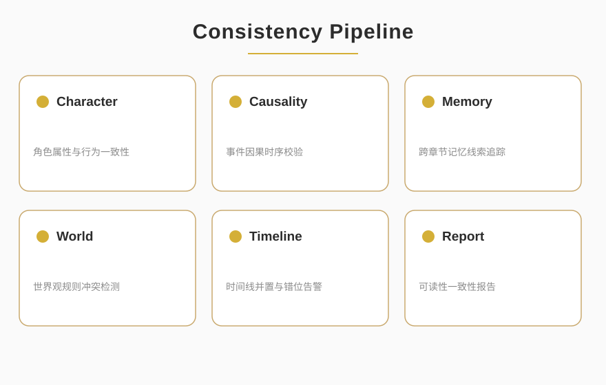

<p align="center">
  
</p>

<p align="center">
      
</p>

<blockquote align="center">
  <em>Long-Form Narrative Consistency Engine</em>
</blockquote>

<div style="max-width:880px;margin:0 auto;padding:0 16px">

## ✦ About

<p style="font-size:15px;line-height:1.8;color:#2C2C2C">STORY-ENGINE is a narrative consistency checking engine for long-form fiction, performing automated audits on character settings, causal timelines, and memory threads to ensure million-word works remain coherent across characters, plots, and worldbuilding. It transforms an editor's intuitive checks into a reusable, structured pipeline.</p>

<p align="center">
  
</p>

</div>

<p align="center">— ✦ —</p>

## ✦ Quick Start

```bash
git clone git@github.com:NOHN-AI/STORY-ENGINE.git
cd STORY-ENGINE
# Pure Python ≥3.8. Engine files use spaces in their names by design.
python "Story Engine for Creator.py"      # creator-facing cognitive audit engine
# or: python "engine for business.py"     # SPL four-stage editorial pipeline
```

<p align="center">— ✦ —</p>

## ✦ What It Does

<div style="max-width:880px;margin:0 auto;padding:0 16px">

STORY-ENGINE audits long-form fiction for narrative consistency, turning an editor's intuition into a reusable, structured pipeline. It works in two layers:

- **Creator engine** (`Story Engine for Creator.py`) — a cognitive-audit layer for storytelling:
  - `ResponsibilityAccount` — every check is anchored to a named accountable node (who / role / stage).
  - `CognitiveAuditEngine` + pluggable `AuditPlugin`s — composable audit dimensions.
  - `CausalNode` with implicit assumptions and a `vulnerability_score` — traces *because → so* logic and grades fragility.
- **Business engine** (`engine for business.py`) — the SPL four-stage native reasoning pipeline:
  1. `STRIP_NARRATIVE` — identify story elements (foreshadow / turn / climax / setup).
  2. `SCAN_ASSUMPTION` — verify character motive & plot-logic soundness.
  3. `HEDGE_RISK` — flag OOC, logic holes, pacing problems.
  4. `LOCK_RESPONSIBILITY` — emit a quality score with traceable optimizations.
  - Risk levels: `SAFE` / `WARNING` / `CRITICAL` / `FATAL`; node states: `RAW` / `STRIPPED` / `AUDITED` / `PRUNED` / `ACTIVE`.

</div>

## ✦ Usage

<div style="max-width:880px;margin:0 auto;padding:0 16px">

```python
import importlib.util

def load(name, path):
    spec = importlib.util.spec_from_file_location(name, path)
    m = importlib.util.module_from_spec(spec); spec.loader.exec_module(m); return m

biz = load("biz", "engine for business.py")
print([s.name for s in biz.SPLStage])   # STRIP_NARRATIVE … LOCK_RESPONSIBILITY
```

Or run the bundled engines directly:

```bash
python "Story Engine for Creator.py"
python "engine for business.py"
```

</div>

## ✦ Project Structure

```
STORY-ENGINE/
├── Story Engine for Creator.py    # creator-facing cognitive audit engine
├── engine for business.py         # SPL four-stage editorial reasoning pipeline
├── assets/                        # banner.svg, overview.svg
└── LICENSE
```

## ✦ License & Authorization

This repository is **not open-source**. It uses a dual-track model: free for individual non-commercial research, paid commercial authorization required for government / enterprise. See [LICENSE](./LICENSE).

<p align="center">
  <a href="https://github.com/NOHN-AI">NOHN-AI</a>
  &nbsp;·&nbsp;
  <a href="https://www.nohnlins.com/">nohnlins.com</a>
  &nbsp;·&nbsp;
  <a href="mailto:ai@nohnlins.com">ai@nohnlins.com</a>
</p>
<p align="center"><sub>NOHN AI · STORY-ENGINE</sub></p>
